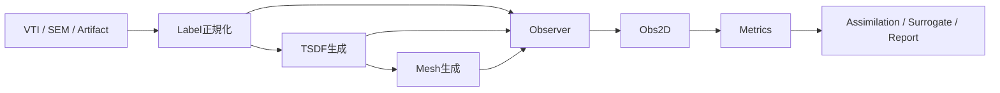

# SDF Feature Scale Transform

`wafergeo` を中心とした、半導体形状データのための幾何変換・観測化・評価基盤です。  
VTI などの 3D ラベルデータを正規化し、SDF / TSDF、mesh、2D 観測 `Obs2D`、評価指標、benchmark、report までを一貫して扱えるようにしています。

## このリポジトリでできること

| 項目 | 内容 |
|---|---|
| 入力正規化 | VTI の軸順、PointData / CellData、材料 ID の揺れを吸収して `LabelVolume` に統一 |
| SDF / TSDF 生成 | multi-material の距離場を材料別チャンネルで生成 |
| mesh 化 | TSDF から表面 mesh や point cloud を生成 |
| 観測化 | 3D 形状を `Obs2D` に落とし込み、2D で比較できる形に統一 |
| 評価 | TSDF loss、contour chamfer、CD line scan などを集約 |
| 実行基盤 | benchmark、preview、audit、report 生成をコマンドから再現可能 |

## 全体像



このリポジトリの核は、3D の表現が何であっても最終的に `Obs2D` に揃えて比較することです。  
そのため、形状処理、実測比較、学習、最適化が同じ評価面の上でつながります。

## まず読むべき文書

初めて見る方は、次の順に読むと全体を追いやすいです。

1. [docs/INDEX.md](docs/INDEX.md)  
   文書全体の案内です。どのファイルが何を説明しているかを一覧で確認できます。
2. [docs/report.md](docs/report.md)  
   実データと既計算済み結果を使った第三者向けレポートです。
3. [docs/Benchmarkrun.md](docs/Benchmarkrun.md)  
   環境構築、dataset を使った benchmark / preview / audit 実行方法をまとめています。
4. [docs/0_design.md](docs/0_design.md)  
   アーキテクチャと設計思想の詳細です。

## クイックスタート

詳細は [docs/Benchmarkrun.md](docs/Benchmarkrun.md) にありますが、最短の入口だけここに載せます。  
以下は Windows PowerShell を前提にした例です。

### 1. 仮想環境を作る

```powershell
Set-Location C:\Users\user\Desktop\SDF_fs
py -3.13 -m venv .venv
.\.venv\Scripts\Activate.ps1
python -m pip install --upgrade pip
python -m pip install -e ".[scipy,viz,dev]"
```

`vtk` を使った mesh backend や 3D 可視化も試す場合は、次を使います。

```powershell
python -m pip install -e ".[scipy,vtk,viz,dev]"
```

### 2. dataset を確認する

```powershell
Test-Path .\dataset\ataset_3d_test2\index.csv
Test-Path .\dataset\ataset_3d_test2\run_0000\vox_t08.vti
```

どちらも `True` なら benchmark / preview を実行できます。

### 3. benchmark を走らせる

```powershell
python .\scripts\run_correspondence_benchmark.py `
  --spec .\configs\correspondence_bench_dataset_t08.yaml `
  --out .\outputs\bench_dataset_t08
```

### 4. preview を作る

```powershell
python .\scripts\run_vti_preview.py `
  --vti .\dataset\ataset_3d_test2\run_0000\vox_t08.vti `
  --out .\outputs\vti_preview_t08
```

### 5. audit を走らせる

```powershell
python .\scripts\run_vti_correspondence_audit.py `
  --vti .\dataset\ataset_3d_test2\run_0000\vox_t08.vti `
  --out .\outputs\vti_audit_t08
```

## 主な成果物

| 実行 | 主な出力 |
|---|---|
| benchmark | `benchmark_manifest.json`, `tables/summary_metrics.csv`, `figures/mesh_boundary_iou.png` |
| preview | `preview_manifest.json`, slice 図、SDF 図、mesh 比較図 |
| audit | raw ラベルと正規化ラベルの対応確認結果、比較テーブル、診断情報 |

## ディレクトリ構成

| パス | 内容 |
|---|---|
| [`wafergeo/`](wafergeo) | コア実装 |
| [`scripts/`](scripts) | benchmark / preview / audit の実行入口 |
| [`configs/`](configs) | 実行 spec や設定 YAML |
| [`tests/`](tests) | pytest ベースのテスト |
| [`docs/`](docs) | 設計資料、手順書、第三者向けレポート |
| [`dataset/`](dataset) | 実行用データセット |
| [`outputs/`](outputs) | 生成結果の保存先 |

## 文書の役割

| ファイル | 何が分かるか |
|---|---|
| [docs/INDEX.md](docs/INDEX.md) | 文書全体の読み方 |
| [docs/report.md](docs/report.md) | 実データを使った第三者向け説明 |
| [docs/Benchmarkrun.md](docs/Benchmarkrun.md) | 初回実行手順と実コマンド |
| [docs/0_design.md](docs/0_design.md) | 全体設計と責務分割 |
| [docs/4_observer.md](docs/4_observer.md) | `Obs2D` を中心にした比較設計 |
| [docs/7_assimilation.md](docs/7_assimilation.md) | 最適化・同化の流れ |

## テスト

```powershell
py -3.13 -m pytest -q
```

pipeline 周辺は optional dependency の有無で挙動が変わるため、再現実行時は [docs/Benchmarkrun.md](docs/Benchmarkrun.md) の注意事項もあわせて確認してください。

## 補足

- このリポジトリの説明資料は `docs/` に集約されています。
- GitHub 上でまず概要だけ見たい場合は、この `README.md` と [docs/INDEX.md](docs/INDEX.md) が入口です。
- 実データと既計算済み結果を含む詳しい説明は [docs/report.md](docs/report.md) を参照してください。
