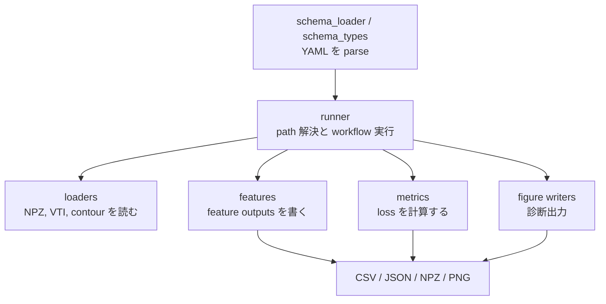

# 開発者マニュアル

コード構成はできるだけ単純に保ちます。

## 責務



| layer | responsibility |
| --- | --- |
| schema | shallow YAML を typed specs に読み込む |
| runner | path を解決し、workflow steps を実行し、rows を集め、writers を呼ぶ |
| loader | input files を domain objects に読む |
| feature | geometry を CSV/JSON/NPZ feature outputs に変換する |
| metric | simulation と target features を比較する |
| figure writer | 既存 outputs を読み、diagnostic PNG/CSV を書く |

runner に loader parsing、feature math、metric math を直接入れないでください。

## Source Of Truth

| concept | file |
| --- | --- |
| 対応している input kinds | `wafergeo/compare/schema_types.py` と loader maps |
| transform feature naming | `wafergeo/compare/feature_taxonomy.py` |
| compare metric requirements | `wafergeo/compare/metric_defs.py` |
| runtime path rules | `wafergeo/compare/runtime_io.py` と runner files |
| output cleanup policy | `wafergeo/compare/output_cleanup.py` |

docs と code が食い違う場合は、まず source-of-truth file を直し、その後 docs を直します。
feature が新しい method に見えるような synonym は増やさないでください。

## Naming

feature の表現は [用語](Terminology.md) に従います。
code-specific feature names は次に mapping できる必要があります。

```text
target_shape x method
```

この mapping は `wafergeo/compare/feature_taxonomy.py` に置きます。
user-facing な transform-eval docs では、`target_shape`, `method`, `code_name` だけを見せます。

## 重要なファイル

| path | purpose |
| --- | --- |
| `wafergeo/compare/schema_types.py` | YAML-facing spec types |
| `wafergeo/compare/runner.py` | `transform` と `compare` |
| `wafergeo/compare/batch_transform_runner.py` | `batch-transform` |
| `wafergeo/compare/transform_eval_runner.py` | `transform-eval` |
| `wafergeo/compare/batch_runner.py` | `batch-compare` |
| `wafergeo/compare/compare_eval_runner.py` | `compare-eval` |
| `wafergeo/compare/feature_outputs.py` | transform feature dispatch |
| `wafergeo/compare/feature_taxonomy.py` | feature naming map |
| `wafergeo/compare/transform_eval_figures.py` | transform-eval diagnostics |
| `wafergeo/compare/compare_eval_figures.py` | compare-eval diagnostics |
| `wafergeo/compare/metric_defs.py` | metric registry |
| `wafergeo/compare/label_loaders.py` | NPZ/VTI label loaders |
| `wafergeo/compare/contour_loaders.py` | contour target loaders |
| `wafergeo/compare/loader.py` | input loader dispatch |

## Checks

```powershell
py -3.13 -m ruff check wafergeo tests
py -3.13 -m mypy wafergeo
py -3.13 -m pytest -q
py -3.13 -m mkdocs build --strict
```

`outputs/`, `site/`, caches、一時的な experiment files はコミットしません。
