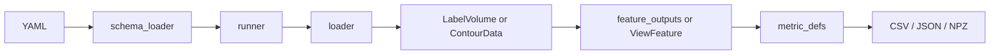

# Developer Manual

このページは、初めて `wafergeo` を改修する開発者向けの入口です。
具体的な loader / feature / metric の追加手順は [Extension Guide](ExtensionGuide.md) を参照してください。

## 設計原則

| 原則 | 内容 |
| --- | --- |
| 入口を増やさない | workflow は `transform` 系と `compare` 系に限定する |
| YAML を浅く保つ | 通常は `task/input/view/features/metrics/output` |
| runner を薄く保つ | runner は loader / feature / metric / output を呼ぶだけ |
| 手法は opt-in | 新 feature / metric は `features.use` / `metrics.use` で明示指定 |
| 出力は flat | CSV/JSON/NPZ を中心に、後段解析で扱いやすくする |
| テストは軽く | synthetic test を中心にし、重い実データ test は通常 suite に入れない |

## コードの読み方

| 場所 | 役割 |
| --- | --- |
| `wafergeo/application/runtime/` | CLI と task dispatch |
| `wafergeo/compare/schema_loader.py` | YAML を読み dataclass に変換 |
| `wafergeo/compare/schema_types.py` | public YAML の型 |
| `wafergeo/compare/runner.py` | `transform` / `compare` の orchestration |
| `wafergeo/compare/batch_transform_runner.py` | `batch-transform` |
| `wafergeo/compare/transform_eval_runner.py` | `transform-eval` |
| `wafergeo/compare/batch_runner.py` | `batch-compare` |
| `wafergeo/compare/compare_eval_runner.py` | `compare-eval` |
| `wafergeo/compare/feature_outputs.py` | transform feature の dispatch |
| `wafergeo/compare/metric_defs.py` | compare metric registry |
| `wafergeo/compare/loader.py` | input loader dispatch |
| `wafergeo/sdf/`, `wafergeo/mesh/` | domain-level feature implementation |

## データの流れ



runner に metric の計算式や loader の詳細を入れないでください。
追加場所を局所化することが、このコードを小さく保つ一番のルールです。

## 変更の分類

| 変更したいこと | 触る場所 |
| --- | --- |
| 新しい入力形式 | `loader.py`, schema, tests |
| 新しい特徴量 | `transform_features.py`, `feature_outputs.py`, schema, tests |
| 新しい metric | metric module, `metric_defs.py`, tests, `Scoring.md` |
| 新しい出力 table | runner 末尾の小さな CSV/JSON writer |
| YAML の説明追加 | `UserManual.md` |
| 設計方針の変更 | `WorkflowRoadmap.md` |

## 内部契約

### LabelVolume

内部の 3D label volume は `[Z,Y,X]` です。
ユーザー向け `npz_label` は `[X,Y,Z]` ですが、loader で変換します。

### ViewFeature

`compare` metric は raw file ではなく `ViewFeature` を見ます。
代表的な field は次です。

| field | 意味 |
| --- | --- |
| `label2d` | 2D view に投影された label |
| `mask` | non-void mask |
| `sdf` | 2D signed distance field |
| `contours` | contour / material boundary points |
| `material_masks` | material ごとの 2D mask |

## 検証

```powershell
py -3.13 -m ruff check wafergeo tests
py -3.13 -m mypy wafergeo
py -3.13 -m pytest -q
py -3.13 -m mkdocs build --strict
```

`outputs/`, `site/`, cache は生成物です。
Git 管理に入れないでください。
