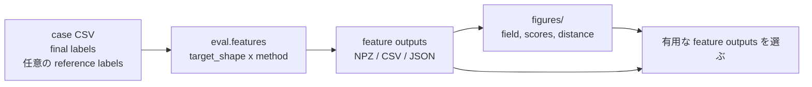
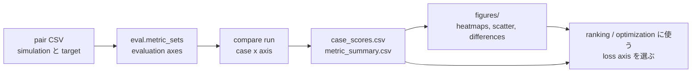

# Eval 可視化

Eval の図は診断用です。CSV/JSON/NPZ が正本です。
図は、どの CSV/NPZ を詳しく見るべきかを決めるために使い、モデリング判断の唯一の根拠にはしません。

## Transform-Eval

transform-eval は次の形で読みます。

```text
target_shape x method, plus relation outputs derived from SDF stacks
```



transform-eval YAML は `eval.features` を使います。各 entry は 1 つの
`target_shape` と 1 つの `method` を明示します。`code_name` は package 側で解決されます。
命名ルールは [用語](Terminology.md) を参照してください。

現在の targets:

| target_shape | 意味 |
| --- | --- |
| `full_shape` | final non-void shape |
| `material_shape` | material-id-specific shapes |
| `process_delta_shape` | reference-to-final changed shape |

現在の feature mapping:

| feature | target_shape | method or relation |
| --- | --- | --- |
| `sdf_raw` | `full_shape` | `sdf` |
| `tsdf_views` | `full_shape` | `multi_scale_tsdf` |
| `udf` | `full_shape` | `udf` |
| `material_sdf` | `material_shape` | `sdf` |
| `material_tsdf_views` | `material_shape` | `multi_scale_tsdf` |
| `material_udf` | `material_shape` | `udf` |
| `material_interface_relation` | `material_shape` | relation |
| `process_delta_sdf` | `process_delta_shape` | `sdf` |
| `process_delta_tsdf_views` | `process_delta_shape` | `multi_scale_tsdf` |
| `process_delta_udf` | `process_delta_shape` | `udf` |
| `process_transition_relation` | `process_delta_shape` | relation |

推奨している確認出力:

| output | 目的 |
| --- | --- |
| `figures/input_shape_sections.png` | 各 case の元 material geometry |
| `figures/by_target_shape/<target_shape>/<method>/field.png` | 明示した target shape と method の field report |
| `figures/by_target_shape/<target_shape>/<method>/scores.png` | その target shape/method の scores |
| `figures/by_target_shape/<target_shape>/<method>/case_distance.png` | その feature space での case distance |
| `figures/by_target_shape/<target_shape>/relations/<relation>/field.png` | SDF fields から派生した relation report |
| `figures/feature_scores.csv` | `role`, `target_shape`, `method`, `relation`, `code_name` を分けた scores |
| `figures/case_distance.csv` | `role`, `target_shape`, `method`, `relation` を分けた case distances |
| `figures/distance_correlation.csv` | redundancy check 用の machine-readable data |

質問別の見るべき出力:

| 問い | 最初に見るもの |
| --- | --- |
| source labels と view direction は正しいか | `figures/input_shape_sections.png` |
| method が意図した geometry を表示しているか | `figures/by_target_shape/<target_shape>/<method>/field.png` |
| feature が case を分離できているか | `figures/case_distance.csv` と `case_distance.png` |
| 2 つの feature が冗長か | `figures/distance_correlation.csv` |
| dataset として出力が大きすぎないか | `figures/feature_scores.csv` の `data_cost` |

異なる target を混ぜた aggregate score は避けてください。別々の score column を使います。

| score | 意味 |
| --- | --- |
| `shape_match` | SDF/TSDF が source shape を復元できるか |
| `boundary_match` | UDF が source boundary neighborhood を捉えるか |
| `interface_match` | material-interface relation が material boundaries と合うか |
| `transition_match` | process-transition relation が changed voxels と合うか |
| `case_sensitivity` | feature が case 間で変化するか |
| `data_cost` | 高いほど feature output が小さい |

サロゲートモデル向けの feature selection では、次の順で確認します。

1. `figures/input_shape_sections.png` で source labels と view が妥当か確認する。
2. `target_shape/method` ごとの `field.png` で、field が意図した geometry を示しているか確認する。
3. `figures/case_distance.csv` で、feature が case を分離しているか見る。
4. `figures/distance_correlation.csv` で、同じ情報を持つ冗長な output を見つける。

多くの冗長な file を使うより、意味を説明できる少数の feature outputs を選んでください。

## Compare-Eval

`compare-eval` は evaluation axes を比較します。設定上は `eval.metric_sets` を使いますが、
名前は比較目的を表すようにします。例: `height_cd`, `shape_distance`,
`material_distance`, `boundary_band_distance`。



output CSV 内の legacy column name `metric_set` は evaluation axis name を意味します。
別概念としてではなく、grouping column として扱ってください。

compare-eval で見るべきこと:

- 各 evaluation axis がどの case を異なる score にするか
- どの metric が comparison loss を支配しているか
- metric を変えると ranking が変わるか
- skipped metrics が結果に影響していないか

推奨している確認出力:

| output | 目的 |
| --- | --- |
| `comparison_loss_heatmap.png` | evaluation axis と case ごとの comparison loss。低いほど良い |
| `ranking_shift_heatmap.png` | baseline からの ranking movement |
| `metric_loss_breakdown.png` | どの metrics が支配的か |
| `cd_vs_sdf_scatter.png` | height-CD axis と SDF shape-distance axis が case を異なる判断にするか |
| `evaluation_axis_summary.png` | coverage, case separation, ranking shift の診断 |
| `representative_differences/*.png` | 選択 case の shape-level inspection |
| `axis_agreement.csv` | evaluation axes 間の pairwise loss correlation と rank agreement |

質問別の見るべき出力:

| 問い | 最初に見るもの |
| --- | --- |
| どの axis が case ごとに良い/悪い loss を出すか | `figures/comparison_loss_heatmap.png` |
| SDF は CD と異なる ranking を出すか | `axis_agreement.csv` と `figures/cd_vs_sdf_scatter.png` |
| どの metric が loss を支配しているか | `figures/metric_loss_breakdown.png` と `metric_summary.csv` |
| disagreement は物理的に意味があるか | `figures/representative_differences/` |
| downstream optimizer に渡す値はどれか | `case_scores.csv` の `comparison_loss` |

ranking や optimization には `comparison_loss` を使います。
`evaluation_axis_summary` は診断用であり objective ではありません。

`cd_vs_sdf_scatter.png` は axis-level の `comparison_loss` を plot します。
raw の `cd_loss` と raw の `sdf_loss` の直接比較ではありません。
per-metric raw loss が必要な場合は `case_scores.csv` と `metric_summary.csv` を見てください。

compare input に明示的な reference geometry がない場合は、`process_delta` compare axis を追加しないでください。
reference がない process-delta score は、測定ではなく仮定を隠すことになります。

`height_cd` と比較する場合は `[x,z]` または `[y,z]` view を使います。
top-view `[x,y]` は SDF shape overlap には有用ですが、height-wise CD と SDF の優劣を判断する view ではありません。

SDF が height-wise CD より有用か判断する場合は、次の 3 点を見ます。

1. `cd_vs_sdf_scatter.png` で CD と SDF が異なる判断をする case を見る。
2. `axis_agreement.csv` で ranking が本当に異なるか見る。
3. `representative_differences/` で disagreement が物理的に意味のある差か確認する。

## コード上の役割

- runners は config を解決し、workflow を実行し、行データを集め、writer を呼びます。
- feature math は feature modules に置きます。
- figure code は `transform_eval_figures.py` と `compare_eval_figures.py` に置きます。
- figure generation には Matplotlib が必要です。依存関係や feature field が不足している場合は、
  incomplete image を作るのではなく明確に失敗させます。
