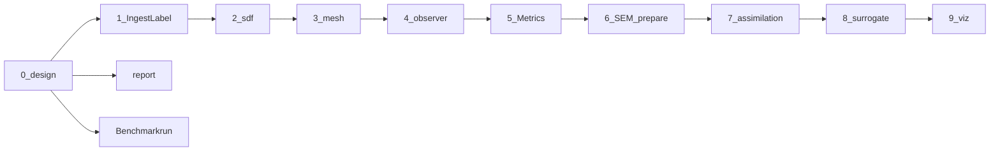

# Documentation Index

## 1. このディレクトリの目的

`docs/` は、このリポジトリにある Markdown 文書をまとめて参照しやすくした場所です。  
設計資料、実行手順、第三者向けレポートを 1 か所に集め、初めて読む人でも「何から読めばよいか」が分かるようにしています。

このディレクトリ内の文書では、特に断りがない限り、パスやコマンドは **リポジトリルート基準** で記述されています。

## 2. 最初に読む順番

第三者が全体像をつかみやすい順番は次です。

1. [0_design.md](0_design.md)  
   リポジトリ全体の思想とアーキテクチャを把握する入口です。
2. [report.md](report.md)  
   実データと既計算結果を使って、このコードが何をしているかを第三者向けに説明したレポートです。
3. [Benchmarkrun.md](Benchmarkrun.md)  
   実際に環境を作り、dataset を使って benchmark / preview / audit を走らせる手順です。
4. 必要な技術領域の個別設計資料  
   `1_` から `9_` までの番号付き文書を、関心のある領域から読むと追いやすいです。

## 3. 目的別の入口

### 全体像を知りたい

- [0_design.md](0_design.md)
- [report.md](report.md)

### データ入力から SDF / mesh までを理解したい

- [1_IngestLabel.md](1_IngestLabel.md)
- [2_sdf.md](2_sdf.md)
- [2-1_sdf_extend.md](2-1_sdf_extend.md)
- [3_mesh.md](3_mesh.md)

### 観測・評価・実測比較を理解したい

- [4_observer.md](4_observer.md)
- [5_Metrics.md](5_Metrics.md)
- [6_SEM_prepare.md](6_SEM_prepare.md)

### 最適化や学習への接続を理解したい

- [7_assimilation.md](7_assimilation.md)
- [8_surrogate.md](8_surrogate.md)

### 可視化・レポート生成を理解したい

- [9_viz.md](9_viz.md)
- [report.md](report.md)

### 実際に手を動かして再現したい

- [Benchmarkrun.md](Benchmarkrun.md)

## 4. 各ファイルの説明

| ファイル | 主題 | 何を説明しているか | こんな人に向いている |
|---|---|---|---|
| [0_design.md](0_design.md) | 全体設計 | artifact 駆動、型設計、パイプライン全体の考え方 | まず全体像をつかみたい人 |
| [1_IngestLabel.md](1_IngestLabel.md) | 入力正規化 | VTI 読み込み、軸順、Point/Cell 差、材料ラベル正規化 | 入力処理の意味を知りたい人 |
| [2_sdf.md](2_sdf.md) | SDF 基本設計 | label から TSDF を作る流れ、チャンネル構造、roundtrip の考え方 | SDF の中心設計を知りたい人 |
| [2-1_sdf_extend.md](2-1_sdf_extend.md) | SDF 拡張 | backend 拡張、feature 拡張、より高度な SDF 利用 | SDF の拡張余地を見たい人 |
| [3_mesh.md](3_mesh.md) | mesh 化 | TSDF から mesh を作る方法、面属性、点群化 | mesh の作り方と注意点を知りたい人 |
| [4_observer.md](4_observer.md) | 観測化 | 3D 表現を `Obs2D` に落とし込む設計、slice / topdown observer | 3D と 2D の橋渡しを理解したい人 |
| [5_Metrics.md](5_Metrics.md) | 評価指標 | TSDF loss、輪郭指標、CD 指標、loss と report の関係 | 評価の考え方を知りたい人 |
| [6_SEM_prepare.md](6_SEM_prepare.md) | 実測前処理 | SEM contour / image を `Obs2D` に整える方法 | 実測比較の入口を知りたい人 |
| [7_assimilation.md](7_assimilation.md) | 同化 | objective、policy、trial artifact、評価セッション | 最適化・同化を理解したい人 |
| [8_surrogate.md](8_surrogate.md) | surrogate | 学習用データセット生成、manifest、QA、teacher feature | surrogate 学習の準備を知りたい人 |
| [9_viz.md](9_viz.md) | 可視化 / report | report runner、extractor、plot plugin、export | 可視化基盤や report を触る人 |
| [Benchmarkrun.md](Benchmarkrun.md) | 実行手順 | 環境構築、dataset 展開、benchmark / preview / audit の実コマンド | 初めて実行する人 |
| [report.md](report.md) | 第三者向け説明 | 実データ、構造図、SDF 結果、benchmark 結果を含む詳細レポート | 非開発者やレビュー担当者 |

## 5. 文書同士の関係

番号付き文書は、だいたい処理の流れに沿って並んでいます。

読み方のコツは次の通りです。

- `0_design.md` は全体方針
- `1` から `6` は主に形状処理と比較基盤
- `7` と `8` はその基盤の上に載る応用
- `9` は結果を人に見せるための層
- `report.md` は設計の要約ではなく、第三者向けの説明資料
- `Benchmarkrun.md` は実装理解ではなく、再現実行のための運用資料

## 6. 迷ったときの使い分け

### 実装の考え方を理解したい

番号付き文書を読みます。  
特に [0_design.md](0_design.md) と [4_observer.md](4_observer.md) が重要です。

### 会議やレビュー向けに概要を説明したい

[report.md](report.md) を開くのが最短です。

### 実際に benchmark を回したい

[Benchmarkrun.md](Benchmarkrun.md) から入るのが最短です。

### どの層がどの責務かだけ知りたい

この `INDEX.md` の「各ファイルの説明」表を先に見て、必要な文書だけ拾い読みすると効率的です。
