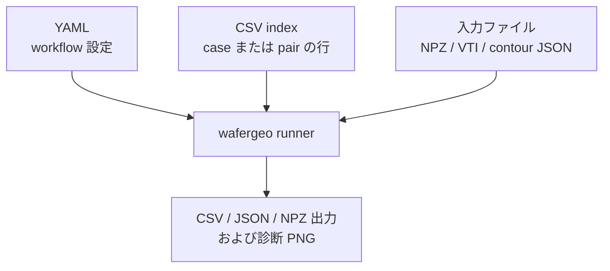

# 入力データ

`wafergeo` は形状入力として label volume を扱います。必要に応じて、
測定 target や抽出 contour として contour file も扱います。
raw data の前処理はパッケージ外で行い、YAML または CSV で入力契約を明示します。

## YAML と CSV

YAML は workflow の実行設定を定義します。CSV index file は実行する case を定義します。



| ファイル | 役割 |
| --- | --- |
| YAML | workflow, view, features, metrics, output directory などの共通設定 |
| CSV | case list または simulation-target pair list |

単一 case の YAML 内の相対パスは、YAML ファイルの場所を基準に解決されます。
batch/eval の CSV 内の相対パスは、CSV ファイルの場所を基準に解決されます。

## Transform Case CSV

`batch-transform` と `transform-eval` で使います。

| column | 意味 |
| --- | --- |
| `case_id` | 出力行やディレクトリ名に使う case 名 |
| `input_kind` | final/current geometry の loader。`npz_label` または `vti_label` |
| `input_path` | final/current label volume のパス |
| `void_id` | empty/no-material space を表す material id。solid shape は `label != void_id` |
| `reference_kind` | initial/reference geometry の loader。process-delta feature で必要 |
| `reference_path` | initial/reference label volume のパス |
| `reference_void_id` | reference label volume の void id |

```csv
case_id,input_kind,input_path,void_id,reference_kind,reference_path,reference_void_id
run_0010,npz_label,../../dataset/run_0010/vox_t08.npz,2,npz_label,../../dataset/run_0010/vox_t00_init.npz,2
```

## Compare Pair CSV

`batch-compare` と `compare-eval` で使います。

| column | 意味 |
| --- | --- |
| `case_id` | 出力行やディレクトリ名に使う pair 名 |
| `simulation_kind` | simulation geometry の loader。`npz_label` または `vti_label` |
| `simulation_path` | simulation label volume のパス |
| `simulation_void_id` | simulation label volume の void id |
| `target_kind` | target の loader。`npz_label`, `vti_label`, `contour_json`。省略時は `contour_json` |
| `target_path` | target file のパス |
| `target_void_id` | label-volume target の void id。`contour_json` では空欄 |
| `target_units` | `contour_json` の単位。省略時は `nm` |

```csv
case_id,simulation_kind,simulation_path,simulation_void_id,target_kind,target_path,target_void_id
run_0006,npz_label,../../dataset/run_0006/vox_t08.npz,2,npz_label,../../dataset/run_0010/vox_t08.npz,2
```

## `void_id`

`void_id` は、空隙、空気、no material を表す material id です。
material shape としては評価しません。

`void_id` を省略すると、material id `0` を void とみなします。
`0` が実 material であるデータでは、YAML、CSV、または NPZ 内で
`void_id` を指定してください。

## NPZ Label Format

`npz_label` は、データサイエンス用途で扱いやすい compact な label-volume format です。

必須 array:

| array | type | 意味 |
| --- | --- | --- |
| `labels` | integer, shape `[X,Y,Z]` | 各 voxel の material id |

任意 array:

| array | type | default | 意味 |
| --- | --- | --- | --- |
| `spacing` | float, shape `[3]` in `[X,Y,Z]` order | `[1,1,1]` | voxel size。単位は nm |
| `origin` | float, shape `[3]` in `[X,Y,Z]` order | `[0,0,0]` | grid origin。単位は nm |
| `material_ids` | integer list | `labels` 内の unique id | 有効な material id の一覧 |
| `material_names` | string list | `material_<id>` | `material_ids` に対応する表示名 |
| `void_id` | integer scalar | `0` when present | empty/no-material label id |

内部では、user-facing な `[X,Y,Z]` の `labels` を canonical な `[Z,Y,X]` に変換します。
ユーザーが作る NPZ は `[X,Y,Z]` のままで問題ありません。

最小 NPZ 例:

```python
import numpy as np

labels = np.full((16, 16, 32), 2, dtype=np.int32)  # 2 = void
labels[4:12, 4:12, 0:20] = 0                     # material 0
labels[6:10, 6:10, 20:28] = 1                    # material 1

np.savez(
    "case.npz",
    labels=labels,
    spacing=np.array([1.0, 1.0, 1.0], dtype=np.float32),
    origin=np.array([0.0, 0.0, 0.0], dtype=np.float32),
    material_ids=np.array([0, 1, 2], dtype=np.int32),
    material_names=np.array(["oxide", "nitride", "void"]),
    void_id=np.array(2, dtype=np.int32),
)
```

## VTI Label Format

`vti_label` は VTK ImageData `.vti` の label volume を読みます。
VTI 入力を安定して扱うには optional dependency の VTK を入れてください。

```powershell
python -m pip install -e ".[vtk]"
```

VTK がない環境でも、対応している VTI については限定的な XML fallback で読みます。

想定する VTI の中身:

| item | requirement |
| --- | --- |
| image type | `VTKFile type="ImageData"` |
| material array | `MaterialIds`, `material_id`, `MaterialId` のいずれかの scalar integer array |
| array location | `CellData` はそのまま使用。`PointData` は nearest sampling で cell label に変換 |
| spacing/origin | VTI の `Spacing` と `Origin` metadata から読む |
| void id | YAML/CSV の `void_id` で指定。省略時は material id `0` |

概念的な VTI 構造:

```xml
<VTKFile type="ImageData">
  <ImageData WholeExtent="0 15 0 15 0 31" Origin="0 0 0" Spacing="1 1 1">
    <Piece Extent="0 15 0 15 0 31">
      <CellData Scalars="MaterialIds">
        <DataArray type="Int32" Name="MaterialIds" format="appended" offset="0"/>
      </CellData>
    </Piece>
  </ImageData>
</VTKFile>
```

実際の label 値は appended data でも inline data でも構いません。
重要なのは、対応している material-id array 名のいずれかが存在し、
integer material label を保存していることです。

## Contour JSON

`contour_json` は、target が full label volume ではなく、測定または抽出された contour の場合に使います。
YAML の `view.axes` が比較に使う 2 軸を選びます。

```json
{
  "schema_version": "contour/v1",
  "units": "nm",
  "coordinate_axes": ["x", "y", "z"],
  "contours": [
    {
      "id": "outer",
      "label": "global",
      "material_id": null,
      "closed": true,
      "points": [[0.0, 0.0, 0.0], [100.0, 0.0, 0.0], [100.0, 80.0, 0.0]]
    }
  ]
}
```
