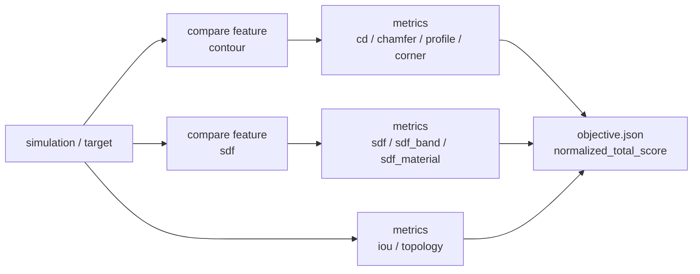

# スコアリング

`compare` は、simulation geometry と target geometry の 2D view 上で metrics を計算します。
raw values は `metrics.csv` に書かれ、重み付き loss は `objective.json` にまとめられます。

## Features と Metrics

`compare` では features と metrics は別 layer です。



| YAML field | 意味 |
| --- | --- |
| `features.use` | 比較用の中間 geometry representation を作る |
| `metrics.use` | 利用可能な representation から loss を計算する |

例えば feature `sdf` は SDF field を作ります。metric `sdf` は simulation の
SDF field と target の SDF field を比較し、SDF loss を書き出します。
同じ単語が両方に出ますが、layer は異なります。

```yaml
features:
  use: [sdf]

metrics:
  use: [sdf]
```

これは次の意味です。

```text
SDF field を作り、その SDF field 同士を比較する
```

## Metrics

| metric | required feature | 用途 |
| --- | --- | --- |
| `cd` | `contour` | cross-section width または edge-position difference |
| `sdf` | `sdf` | view 全体の signed-distance field loss |
| `sdf_band` | `sdf` | boundary 近傍の SDF loss |
| `sdf_material` | `sdf` | per-material SDF loss |
| `iou` | none | mask overlap |
| `chamfer` | `contour` | contour point distance |
| `profile` | `contour` | profile value difference |
| `corner` | `contour` | local corner-shape difference |
| `topology` | none | connectivity と大域形状の check |

required feature がある metric を使う場合は、その feature を `features.use` に含める必要があります。
例えば `sdf`, `sdf_band`, `sdf_material` はすべて feature `sdf` が必要です。

## Metric の選び方

まず形状評価で答えたい問いを決め、その問いに合う metric を選びます。

| 問い | 最初に使う metric | 追加診断 |
| --- | --- | --- |
| 従来の height-wise CD で十分か確認したい | `[x,z]` または `[y,z]` の `cd` | `profile`, `corner` |
| 投影された全体 shape が合っているか見たい | `sdf` と `iou` | `chamfer` |
| どの material が mismatch を支配しているか見たい | `sdf_material` | compare outputs の `material_confusion.csv` |
| boundary placement error が重要か見たい | `sdf_band` | representative difference figures |

`cd` は説明しやすく baseline として有用ですが、material 内部のずれや gauge 外の
shape change を見落とすことがあります。CD objective を置き換える前に、
`compare-eval` で SDF-based axis が ranking を変えるか確認してください。

## Objective

```yaml
metrics:
  use: [cd, sdf, iou]
  weights:
    cd: 1.0
    sdf: 1.0
    iou: 1.0
```

optimization や ranking には `objective.json` を使います。
どの metric が objective に効いたか調べるには `metrics.csv` を使います。

`normalized_total_score` は case 間 ranking 用です。解析や plot には
`cd_loss`, `sdf_loss`, `iou_loss` などの raw metric columns も残されています。

## Compare-Eval の評価軸

`compare-eval` は、同じ case 群に対して evaluation axes を比較します。
axis 名は、どの形状評価の問いに答えるかで付けます。

| axis | 用途 |
| --- | --- |
| `height_cd` | `[x,z]` または `[y,z]` view の従来 height-wise CD baseline |
| `shape_distance` | 全体 shape overlap と SDF distance |
| `material_distance` | label volume がある場合の per-material distance |
| `boundary_band_distance` | boundary 近傍の SDF sensitivity check |

process-delta comparison は、compare input に reference geometry が含まれる場合だけ使ってください。

`axis_agreement.csv` と `cd_vs_sdf_scatter.png` を使うと、SDF evaluation axis が
height-wise CD を超える情報を持っているか確認できます。scatter plot は axis-level の
`comparison_loss` を使います。raw の `cd_loss` や `sdf_loss` が必要な場合は
`case_scores.csv` を見てください。

ranking が同じなら、その case set では SDF が意思決定を変えていません。
ranking が異なる場合は、optimization objective を選ぶ前に representative differences を確認してください。
