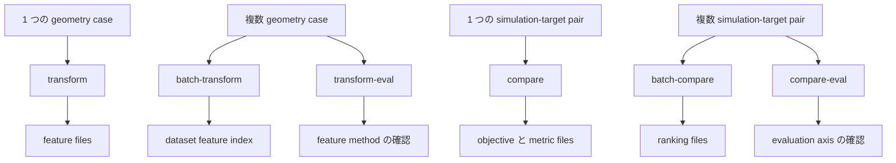

# ユーザーマニュアル

`wafergeo` は geometry data を再利用可能な feature file へ変換し、
simulation geometry と target geometry を比較します。
外部の学習、解析、最適化コードは、ここで出力される CSV/JSON/NPZ を利用してください。

## 入力

| kind | 用途 |
| --- | --- |
| `npz_label` | NPZ file 内の label volume。`labels` は shape `[X,Y,Z]`。任意 array は `spacing`, `origin`, `material_ids` など |
| `vti_label` | VTI に保存された label volume。material array 名は `MaterialIds`, `material_id`, `MaterialId` のいずれか |
| `contour_json` | compare metrics 用の contour target |

CSV columns、`void_id`、NPZ/VTI の中身、例は [入力データ](InputData.md) を参照してください。

## YAML の形

YAML は浅く保ちます。

```yaml
task: transform

input:
  simulation:
    kind: npz_label
    path: data/final.npz

view:
  axes: [x, z]
  depth_axis: y

features:
  use: [sdf_raw, material_sdf, material_tsdf_views]

output:
  dir: outputs/example_transform
```

process-aware feature には reference label と `process.enabled` が必要です。

```yaml
task: transform

input:
  simulation:
    kind: npz_label
    path: data/final.npz
  reference:
    kind: npz_label
    path: data/initial.npz

process:
  enabled: true

features:
  use: [process_delta_sdf, process_delta_tsdf_views]

output:
  dir: outputs/process_delta
```

`transform-eval` では、target shape と method を分けるために `eval.features` を使います。

```yaml
task: transform-eval

input:
  index: configs/runs/my_transform_cases.csv

eval:
  features:
    - target_shape: full_shape
      method: sdf
    - target_shape: material_shape
      method: sdf
    - target_shape: process_delta_shape
      method: multi_scale_tsdf

process:
  enabled: true

output:
  dir: outputs/my_transform_eval
```

`compare-eval` では互換性のため YAML field 名は `eval.metric_sets` ですが、
各 key は evaluation axis として読みます。

```yaml
task: compare-eval

input:
  index: configs/runs/my_compare_pairs.csv

eval:
  metric_sets:
    height_cd:
      features:
        use: [contour]
      metrics:
        use: [cd]
    shape_distance:
      features:
        use: [sdf, contour]
      metrics:
        use: [sdf, iou]

output:
  dir: outputs/my_compare_eval
```

## Workflows



| workflow | 用途 |
| --- | --- |
| `transform` | 1 case を feature file に変換する |
| `batch-transform` | 同じ feature list で複数 case を変換する |
| `transform-eval` | 複数 case 上で feature method を比較する |
| `compare` | 1 つの simulation と 1 つの target を比較する |
| `batch-compare` | 複数の simulation/target pair を比較する |
| `compare-eval` | 同じ case 群で evaluation axis を比較する |

## Transform Features

transform features は [用語](Terminology.md) の定義に従って読みます。

```text
target_shape x method, plus relation outputs derived from SDF stacks
```

| feature | target_shape | method or relation |
| --- | --- | --- |
| `sdf_raw` | `full_shape` | `sdf` |
| `tsdf_views` | `full_shape` | `multi_scale_tsdf` |
| `udf` | `full_shape` | `udf` |
| `material_sdf` | `material_shape` | `sdf` |
| `material_tsdf_views` | `material_shape` | `multi_scale_tsdf` |
| `material_udf` | `material_shape` | `udf` |
| `material_interface_relation` | `material_shape` | relation |
| `process_delta_sdf` | `process_delta_shape` | `sdf` |
| `process_delta_tsdf_views` | `process_delta_shape` | `multi_scale_tsdf` |
| `process_delta_udf` | `process_delta_shape` | `udf` |
| `process_transition_relation` | `process_delta_shape` | relation |

`material_sdf` と `process_delta_sdf` は別々の method ではありません。
同じ SDF を異なる target shape に適用したものです。
relation outputs は material interfaces や reference-to-final material transitions を表します。

## Transform-Eval Outputs

`transform-eval` は通常の eval CSV に加えて診断図を書き出します。
figure directory は quick inspection layer であり、正本は CSV/JSON/NPZ です。

重要な figure files:

| output | 用途 |
| --- | --- |
| `figures/input_shape_sections.png` | 全 case の元 material sections |
| `figures/by_target_shape/<target_shape>/<method>/field.png` | 明示的な target shape と method 1 組の field report |
| `figures/by_target_shape/<target_shape>/<method>/scores.png` | その target shape/method の score |
| `figures/by_target_shape/<target_shape>/<method>/case_distance.png` | その feature space での case distance |
| `figures/by_target_shape/<target_shape>/relations/<relation>/field.png` | SDF fields から派生した relation report |
| `figures/feature_scores.csv` | `role`, `target_shape`, `method`, `relation`, `code_name` を分けた machine-readable scores |
| `figures/case_distance.csv` | `role`, `target_shape`, `method`, `relation` を分けた machine-readable case distances |

異なる feature type を 1 つの混合 score で読まないでください。
`shape_match`, `boundary_match`, `interface_match`, `transition_match`,
`case_sensitivity`, `data_cost` は、それぞれ別の問いに答える指標です。

## Compare Metrics

`features.use` は比較用の中間表現を作ります。`metrics.use` はその中間表現から
loss を計算します。例えば feature `sdf` は SDF field を作り、metric `sdf` は
2 つの SDF field を比較します。

| metric | required feature | 用途 |
| --- | --- | --- |
| `cd` | `contour` | cross-section CD / edge position difference |
| `chamfer` | `contour` | contour point distance |
| `sdf` | `sdf` | 2D SDF field loss |
| `sdf_band` | `sdf` | boundary-band SDF loss |
| `sdf_material` | `sdf` | per-material SDF loss |
| `iou` | none | mask overlap |
| `profile` | `contour` | profile value difference |
| `corner` | `contour` | local corner-shape difference |
| `topology` | none | connectivity and large-shape checks |

metric の詳細は [スコアリング](Scoring.md) を参照してください。

## Compare-Eval Outputs

`compare-eval` は、同じ case 群で名前付き evaluation axis を比較します。
YAML field 名は `eval.metric_sets` ですが、各 key は evaluation axis として読んでください。

| axis | 用途 |
| --- | --- |
| `height_cd` | `[x,z]` または `[y,z]` view での height-wise CD baseline |
| `shape_distance` | SDF と IoU による shape comparison |
| `material_distance` | label-volume target 向けの per-material SDF diagnostic |
| `boundary_band_distance` | boundary-neighborhood SDF diagnostic |

compare-eval outputs は次の順で読みます。

1. `axis_agreement.csv`
2. `figures/cd_vs_sdf_scatter.png`
3. `figures/comparison_loss_heatmap.png`
4. `figures/representative_differences/`

`comparison_loss` は evaluation axis 内の ranking や optimization に使う normalized value です。
`case_scores.csv` には `cd_loss`, `sdf_loss`, `iou_loss`, `sdf_material_loss`,
`sdf_band_loss` などの per-metric raw columns が含まれます。

## 生成物

CSV/JSON/NPZ outputs が正本です。PNG outputs は診断用です。
生成された `outputs/`, `site/`, caches はコミットしません。
