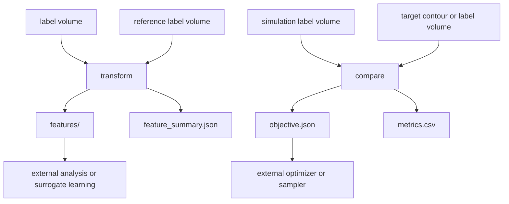

# Workflow Roadmap

このページは、今後の実装で迷わないための設計方針です。
細かい TODO リストではなく、`wafergeo` が守るべき入口、出口、責務を定義します。

## 絶対に守る目的

`wafergeo` は次を行うパッケージです。

- simulation または measurement-derived geometry を特徴量へ変換する。
- simulation と target observation を比較する。
- 外部の解析、最適化、サロゲート学習に渡しやすい CSV/JSON/NPZ を作る。
- 第三者が loader / feature / metric を追加しやすい構造を保つ。

このパッケージ内では、サロゲート学習、シミュレーション実行、最適化 sampler は実装しません。

## workflow family

| family | workflow | 役割 |
| --- | --- | --- |
| Feature | `transform` | 1 case の特徴量化 |
| Feature | `batch-transform` | 複数 case の特徴量化 |
| Feature | `transform-eval` | 複数 feature set の比較 |
| Compare | `compare` | 1 pair の比較 |
| Compare | `batch-compare` | 複数 pair の比較と ranking |
| Compare | `compare-eval` | 複数 metric set の比較 |

新しい workflow は、この family に入る場合だけ検討します。
通常は workflow を増やさず、feature または metric を追加します。

## transform と compare の責務



| workflow | 判断対象 | 追加するもの |
| --- | --- | --- |
| `transform` | 元データを筋よく特徴量化できるか | 3D/2D feature |
| `compare` | target とどれくらい違うか | metric |
| `transform-eval` | feature 候補が case 差分を表現するか | feature set |
| `compare-eval` | metric set が比較目的に合うか | metric set |

## process-aware transform

加工差分を扱う場合は、最終形状だけでなく初期形状を `input.reference` として渡します。

```yaml
process:
  enabled: true

input:
  simulation:
    kind: npz_label
    path: final.npz
  reference:
    kind: npz_label
    path: initial.npz
```

この mode では、加工された領域を抽出して次の特徴量を作れます。

| feature | 目的 |
| --- | --- |
| `process_delta_profile` | etch / deposit / material change の量と transition を集計する |
| `process_delta_sdf` | 加工差分領域そのものを距離場として特徴量化する |

全体形状の feature と加工差分 feature は両方出せます。
サロゲート学習では、全体形状と加工差分を別 channel / 別 table として扱えるようにします。

## 出力方針

| 出力 | 方針 |
| --- | --- |
| CSV | table として解析しやすい summary |
| JSON | metadata、objective、run info |
| NPZ | feature tensor |
| PNG | 補助確認だけ。評価の正は CSV/JSON/NPZ |

生成物は `outputs/` に出します。
Git 管理には入れません。

## 今後の拡張優先度

| 優先 | 内容 | 追加先 |
| --- | --- | --- |
| P1 | feature / metric の実データ smoke を整える | configs / docs |
| P2 | 3D field feature の改善 | feature |
| P3 | process delta feature の改善 | feature |
| P4 | boundary / corner / topology metric の改善 | metric |
