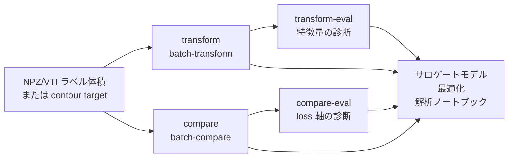

# wafergeo

`wafergeo` は、シミュレーション形状や測定由来の形状データを
特徴量ファイルへ変換し、形状同士を比較評価するためのパッケージです。
出力される CSV/JSON/NPZ は、外部の解析ノートブック、サロゲートモデル、
最適化コードから利用することを想定しています。

データサイエンティスト視点では、役割は大きく 2 つです。

1. 学習や解析に使う再利用可能な形状特徴量を作る。
2. シミュレーション形状とターゲット形状を、明示した評価軸で比較する。



## ワークフロー

| 目的 | workflow | 主な出力 |
| --- | --- | --- |
| 1 ケースを特徴量化する | `transform` | `features/`, `feature_summary.json` |
| 複数ケースを特徴量化する | `batch-transform` | `dataset_index.csv`, `features_summary.csv` |
| 特徴量手法を評価する | `transform-eval` | CSV summaries, `figures/` |
| 1 つの simulation/target ペアを比較する | `compare` | `objective.json`, `metrics.csv`, `difference.png` |
| 複数ペアを比較する | `batch-compare` | `objectives.csv`, `ranking.csv` |
| 比較評価軸を評価する | `compare-eval` | `metric_set_summary.csv`, `case_scores.csv`, `figures/` |

## 実務での読み進め方

| ステップ | 参照先 |
| --- | --- |
| 入力データを用意する | [入力データ](InputData.md)。まずは `npz_label` を推奨します。VTI が必要な場合だけ `vti_label` を使います。 |
| 小さい example を実行する | [クイックスタート](Quickstart.md) |
| 特徴量出力を選ぶ | [用語](Terminology.md) と `transform-eval` |
| 比較 loss を選ぶ | [スコアリング](Scoring.md) と `compare-eval` |
| 図を読む | [Eval 可視化](EvalVisualization.md) |
| パッケージを拡張する | [開発者マニュアル](DeveloperManual.md) と [拡張ガイド](ExtensionGuide.md) |

## 特徴量評価の用語

`transform-eval` は、次の考え方で読みます。

```text
target_shape x method
```

例:

- `sdf_raw`: `target_shape=full_shape`, `method=sdf`
- `material_sdf`: `target_shape=material_shape`, `method=sdf`
- `process_delta_sdf`: `target_shape=process_delta_shape`, `method=sdf`
- `material_interface_relation`: material SDF channels から派生した relation
- `process_transition_relation`: reference/final の変化から派生した relation

`transform-eval` YAML は `eval.features` を使います。`compare-eval` YAML は
`eval.metric_sets` を使います。`compare-eval` では、各 `metric_sets` の key は
評価軸名として読みます。

## 初めて読む人向け

| 知りたいこと | ページ |
| --- | --- |
| 最初の example を実行したい | [クイックスタート](Quickstart.md) |
| NPZ, VTI, CSV 入力を用意したい | [入力データ](InputData.md) |
| 名前のルールを確認したい | [用語](Terminology.md) |
| YAML と出力を理解したい | [ユーザーマニュアル](UserManual.md) |
| eval 図を解釈したい | [Eval 可視化](EvalVisualization.md) |
| view の意味を知りたい | [ビュー](View.md) |
| metric を理解したい | [スコアリング](Scoring.md) |
| コード構成を把握したい | [開発者マニュアル](DeveloperManual.md) |
| loader/feature/metric を追加したい | [拡張ガイド](ExtensionGuide.md) |
