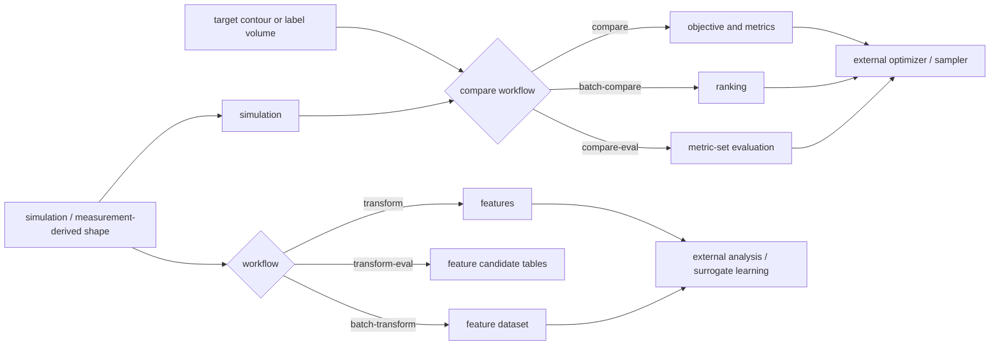

# wafergeo

`wafergeo` は、半導体プロセスのシミュレーション形状や実測由来の形状を、
解析しやすい特徴量へ変換し、必要に応じてターゲット形状と比較するための
小さな Python パッケージです。

このコードの責務は、特徴量データセットと比較 loss を作るところまでです。
サロゲートモデルの学習、シミュレーション実行、最適化サンプラーは外部で扱います。

## できること

| 用途 | workflow | 主な出力 | 効果 |
| --- | --- | --- | --- |
| 1 case の特徴量化 | `transform` | `features/`, `feature_summary.json` | 形状を SDF、material field、profile などへ変換する |
| 複数 case の特徴量化 | `batch-transform` | `dataset_index.csv`, `features_summary.csv` | 学習や解析に使う feature dataset をまとめて作る |
| 特徴量候補の評価 | `transform-eval` | `candidate_eval_summary.csv`, `case_variation_summary.csv` | どの特徴量が入力差分を表現できているか比較する |
| 1 pair の形状比較 | `compare` | `objective.json`, `metrics.csv`, `difference.png` | simulation と target の差を数値化する |
| 複数 pair の比較 | `batch-compare` | `objectives.csv`, `ranking.csv` | 複数 case を target に近い順に並べる |
| metric set の評価 | `compare-eval` | `candidate_summary.csv`, `case_scores.csv` | どの metric set が比較目的に合うか検討する |

## 基本方針

- ユーザーが編集するのは YAML と、batch/eval 用の index CSV だけです。
- 通常 YAML は `task / input / view / features / metrics / output` を基本にします。
- 加工差分を使うときだけ `process.enabled: true` と `input.reference` を使います。
- eval workflow だけ `eval.candidates` を使えます。
- 出力の正は CSV/JSON/NPZ です。PNG は補助確認用だけです。

## 読む順番

| 目的 | 読むページ |
| --- | --- |
| すぐ動かしたい | [Quickstart](Quickstart.md) |
| YAML と出力を理解したい | [User Manual](UserManual.md) |
| 2D view の意味を確認したい | [View](View.md) |
| metric の使い分けを確認したい | [Scoring](Scoring.md) |
| コードを改修したい | [Developer Manual](DeveloperManual.md) |
| loader / feature / metric を追加したい | [Extension Guide](ExtensionGuide.md) |
| 今後の設計方針を確認したい | [Workflow Roadmap](WorkflowRoadmap.md) |

## 全体 workflow

MkDocs の標準テーマでは Mermaid はコードブロックとして表示されます。
Mermaid 対応の theme / plugin を使う場合は図として表示できます。
