# SDF_fs コードベース理解レポート

## 0. 本レポートの位置づけ

本レポートは、`SDF_fs` リポジトリが何を目的にし、どのような入力を受け取り、どのような形で SDF・Mesh・2D観測・評価結果を作るのかを、第三者が追いやすい形で整理したものです。  
説明は概念だけでなく、すでに保存済みの実データと実行結果に基づいています。代表ケースとして、入力は `dataset/ataset_3d_test2/run_0000/vox_t08.vti`、結果は `outputs/vti_preview_postproc_t08/` と `outputs/bench_vti_t08_x3/` を用いています。

### 0.1 参照した主な入力・出力

| 種別 | パス | 用途 |
|---|---|---|
| データセット一覧 | `dataset/ataset_3d_test2/index.csv` | run 全体の規模確認 |
| 代表ケース条件 | `dataset/ataset_3d_test2/run_0000/inputs.json` | 1 run の入力条件確認 |
| preview 要約 | `outputs/vti_preview_postproc_t08/preview_manifest.json` | ラベル変換・SDF・mesh の結果確認 |
| SDF 要約 | `outputs/vti_preview_postproc_t08/sdf/sdf_summary_full.json` | TSDF stack の shape / dtype / range 確認 |
| preview 表 | `outputs/vti_preview_postproc_t08/tables/*.csv` | 断面一致度と材料体積差の確認 |
| benchmark 表 | `outputs/bench_vti_t08_x3/tables/*.csv` | backend / policy 差の比較 |

### 0.2 先に結論

このコードベースの核は、3D 形状をそのまま比較しないことです。  
入力がボクセルラベルであっても、距離場であっても、メッシュであっても、最終的には 2D の比較形式 `Obs2D` にそろえ、同じ評価指標で扱えるようにしています。

この設計により、次の 4 つが一つにつながっています。

1. 入力正規化
2. SDF / mesh 生成
3. 2D 観測化と定量評価
4. surrogate 学習・assimilation・report 生成

---

## 1. 背景

半導体形状の評価では、同じ対象を見ていても、データの持ち方が複数あります。

- シミュレーション出力は 3D ボクセルラベル
- 幾何表現は SDF や mesh
- 実測に近い情報は 2D の断面や top-down 画像
- 学習や最適化では、さらに別の入力形式が必要

このとき、各処理が個別最適で実装されると、次の問題が起きます。

- 入力ごとに軸順や単位の扱いが揺れる
- 同じ形状でも label / SDF / mesh で整合が崩れる
- 3D 予測と 2D 実測を同じ尺度で比べにくい
- 学習用データ、同化、可視化の数字がずれる
- 実験の再現性が落ちる

本コードは、この問題を「正規形」「Artifact」「共通比較ドメイン」の 3 本柱で整理しています。

---

## 2. 課題

### 2.1 入力データ側の課題

VTI 入力には、下流処理を不安定にしやすい揺れがあります。

- `PointData` か `CellData` かが一定でない
- 軸順が可視化系と配列系でずれる
- 材料 ID の意味づけが run ごとに異なる可能性がある
- 外部材料、空隙、未知 ID をどう扱うかを統一しにくい

### 2.2 幾何表現側の課題

multi-material の 3D 形状は、単純な binary solid より難しいです。

- 材料ごとに内部・外部を区別する必要がある
- 界面は 1 枚の面ではなく、材料の組み合わせとして意味を持つ
- mesh 化すると可視化は良くなるが、元のボクセル境界からズレる可能性がある

### 2.3 評価側の課題

評価で本当に欲しいのは「元データと見た目が近いか」ではなく、「観測された形状特徴にどれだけ整合するか」です。  
そのためには 3D のまま比較するより、最終的に 2D 観測へ落として比較する方が現実的です。

---

## 3. 目的

本コードの目的は、次の 3 点に整理できます。

### 3.1 入力を canonical にする

VTI や contour のような生データを、そのまま下流へ流さず、まず `GridSpec`・`Meta`・`LabelVolume` などの正規形へ変換します。

### 3.2 3D 表現を共通比較面へそろえる

`LabelVolume`、`TSDFVolume`、`MeshGeom` のように表現が違っても、最終的には `Obs2D` に変換し、同じ metric で比較できるようにします。

### 3.3 評価と活用を一体化する

同じ基盤の上で、

- preview
- benchmark
- surrogate dataset 作成
- assimilation objective
- report 生成

を回せるようにし、実験の追跡と再利用をしやすくします。

---

## 4. 入力データの構造

### 4.1 データセット全体の構造

今回確認した `dataset/ataset_3d_test2` には 43 runs があります。  
代表例として `run_0000` を見ると、各 run は「条件 + 時系列 3D ラベル + 可視化資材」で構成されています。

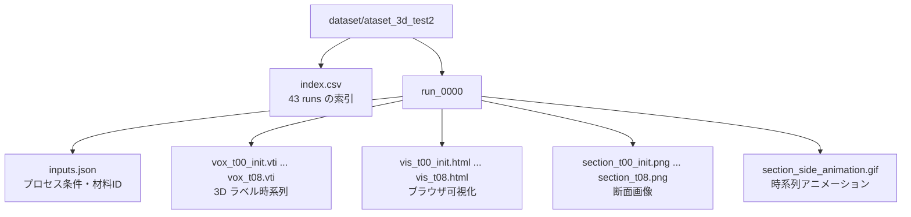

### 4.2 代表 run のファイル構成

`run_0000` の実ファイルを、メタデータファイル `._section_t05.png` を除いて数えると次の通りです。

| 項目 | 数 |
|---|---:|
| 総ファイル数 | 29 |
| VTI | 9 |
| HTML | 9 |
| PNG | 9 |
| GIF | 1 |
| 条件 JSON | 1 |

この構造からわかるのは、1 run が「単発の 3D 形状」ではなく、「条件つきの時系列プロセス結果」として整理されていることです。

### 4.3 入力条件の代表値

`run_0000/inputs.json` から、第三者が把握しやすい主要条件だけ抜き出すと次の通りです。

| 項目 | 値 | 説明 |
|---|---:|---|
| `dx_nm` | 2.0 | ボクセル間隔 |
| `voxel_bounds_nm` | `[-100,100,-100,100,-400,150]` | 解析領域の物理範囲 |
| `total_duration_s` | 24.0 | 総計算時間 |
| `n_snapshots` | 8 | 保存スナップショット数 |
| `snapshot_times_s` | `0,3,6,9,12,15,18,21,24` | 観測時刻 |
| `outside_material_id` | 2 | 外部材料 ID |
| `expected_material_ids` | `0..10` | 想定材料 |

ここから、入力は「nm スケールの空間情報を持つ材料ラベル時系列」であることがわかります。

---

## 5. 本コードの全体手法

### 5.1 全体ワークフロー

本コードの中核ワークフローは次の通りです。

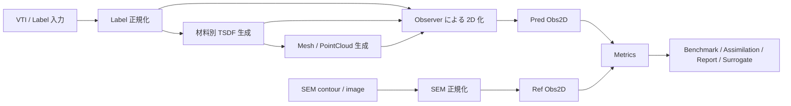

この図の重要点は、途中の 3D 表現が何であっても、最後は `Obs2D` に集約されることです。

### 5.2 カテゴリ別の役割一覧

| カテゴリ | 役割 | 主な入出力 | 代表ファイル |
|---|---|---|---|
| Core | 正規形と再現性の土台 | `GridSpec`, `Meta`, typed data | `wafergeo/core/types.py` |
| IO / Label | VTI の揺れを吸収 | raw VTI -> `LabelVolume` | `wafergeo/label/normalize.py` |
| SDF | 材料別距離場を作る | `LabelVolume` -> `TSDFVolume` | `wafergeo/sdf/build.py` |
| Mesh | 表面化・点群化 | `TSDFVolume` -> `MeshGeom` / `PointCloud` | `wafergeo/mesh/build.py` |
| Observe | 3D を 2D 比較形式へ変換 | geom -> `Obs2D` | `wafergeo/observe/topdown.py`, `wafergeo/observe/slice.py` |
| Metrics | 2D 上で比較 | `Obs2D` vs `Obs2D` -> objective | `wafergeo/metrics/aggregate.py` |
| SEM | 実測側の 2D 参照を作る | contour/image -> `Obs2D` | `wafergeo/sem/build_obs.py` |
| Surrogate | 学習用データセット化 | artifacts -> manifest/package | `wafergeo/surrogate/builder.py` |
| Assimilation | 候補パラメータ評価 | params -> `EvalResult` | `wafergeo/assimilation/objective.py` |
| Reports | 表・図・HTML 出力 | results -> report assets | `wafergeo/reports/runner.py` |

### 5.3 カテゴリ別の代表手法

| カテゴリ | 代表手法 |
|---|---|
| Label 正規化 | 軸順調整、Point->Cell 変換、unknown policy、材料 ID remap |
| SDF | EDT、TSDF truncation、boundary feature、pair code |
| Mesh | `naive_interface`、`vtk`、`material_shell`、`interface_mesh` |
| Observe | `slice`、`topdown_exposed`、2D TSDF、輪郭抽出 |
| Metrics | `tsdf_band_robust_weight`、`contour_chamfer`、`cd_linescan` |
| SEM | contour 正規化、座標変換、再サンプリング |
| Assimilation | parameter decode、predict、observe、objective aggregation |

### 5.4 なぜ `Obs2D` にそろえるのか

この設計の価値は、比較の軸を一つにできることです。

- label 同士の比較だけに閉じない
- SDF や mesh をそのまま比較しなくてよい
- 実測 SEM を同じ形式に変換して直接比較できる
- surrogate や assimilation でも同じ metric を使い回せる

つまり、`Obs2D` は単なる画像ではなく、「3D 幾何を評価可能な 2D 観測面へ落とした共通言語」です。

---

## 6. 代表ケースの既計算結果

ここからは、`run_0000 / vox_t08.vti` に対して保存済みの preview / benchmark 結果を用い、実際に何が得られているかを見ます。

### 6.1 preview 出力の構造

`outputs/vti_preview_postproc_t08/` には、preview 実行の成果物がまとまっています。

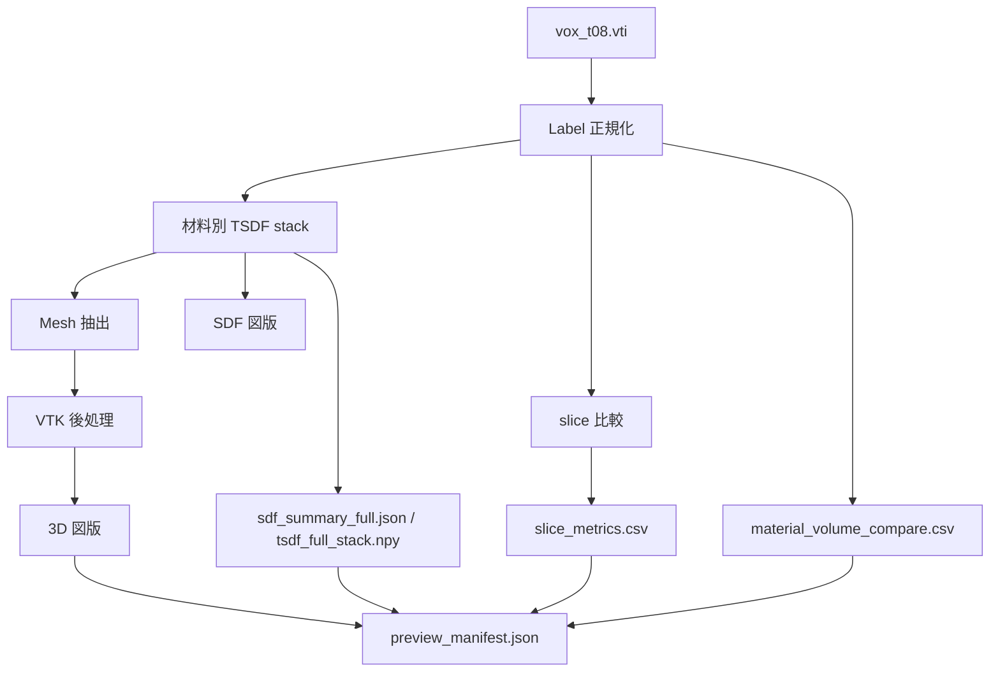

### 6.2 preview の主要要約値

| 項目 | 値 | 意味 |
|---|---|---|
| source array | `MaterialIds` | VTI の材料配列名 |
| source location | `point` | 元データは PointData |
| converted_from_point | `true` | Cell ベースへ変換した |
| point-to-cell policy | `nearest` | 変換規則 |
| selected material ids | `0,2,5,6,7,8,9,10,11` | TSDF 化した材料 |
| TSDF shape | `9 x 274 x 99 x 99` | 9 材料分の 4D stack |
| total TSDF values | `24,169,266` | 全浮動小数値数 |
| TSDF storage | `float32`, 約 `92.2 MiB` | 物理保存サイズの目安 |
| `mu_nm` | `20.0` | truncation 長さ |
| NaN / Inf | `0 / 0` | 数値破綻なし |

この表から、SDF が「1 枚の距離場」ではなく、「材料ごとの TSDF チャンネル群」として保存されていることがわかります。

---

## 7. 入力構造がわかるグラフ

### 7.1 run 内データ構成グラフ

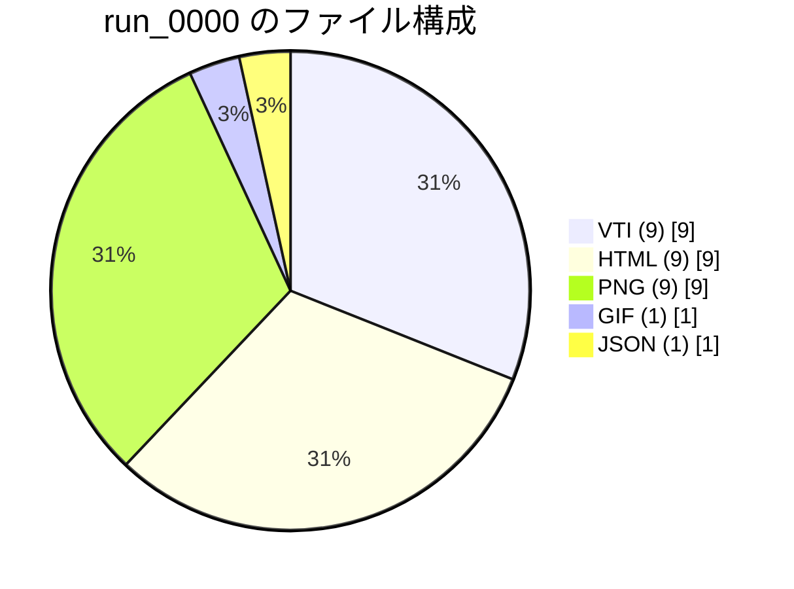

#### このグラフの読み方

このグラフは、1 run が何でできているかを示します。  
VTI だけではなく、HTML 可視化・断面 PNG・GIF まで含まれているため、このデータセットは「解析用の生データ」だけでなく「確認・共有用の可視化資材」も同梱された構造になっています。

### 7.2 材料構成グラフ

`preview_manifest.json` の `all_material_counts` をもとに、最終時刻 `t08` の材料構成比を再可視化すると次の通りです。

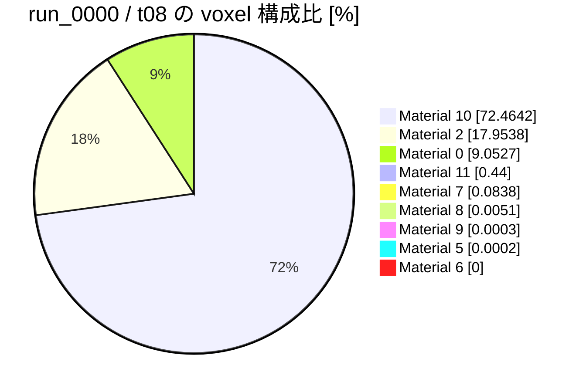

#### このグラフの読み方

このケースでは `Material 10` が全体の約 72% を占めています。  
一方で、`Material 5` や `Material 6` のような非常に少ない材料も消えていません。  
これは、本コードが少数材料を 1 つの binary solid に潰さず、材料別チャンネルとして保持していることを示します。

### 7.3 主要界面の構造グラフ

`pair_counts.raw` から、出現回数の多い材料界面を上位 5 件で図示すると次の通りです。

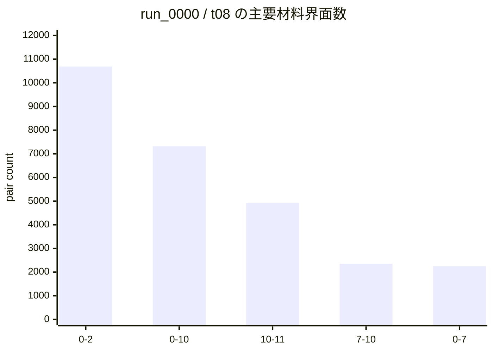

#### このグラフの読み方

このグラフは「どの材料同士の境界が主要な形状特徴になっているか」を示します。  
特に `0-2`、`0-10`、`10-11` が大きく、今回の形状が単純な単一材料塊ではなく、複数材料の接触関係で成り立っていることがわかります。  
SDF の boundary feature や pair code が重要になる理由はここにあります。

---

## 8. SDF 結果がわかるグラフ

### 8.1 SDF stack の構造

今回の TSDF は、1 本の距離場ではなく、材料ごとに 1 チャンネルずつ持つ 4D stack です。

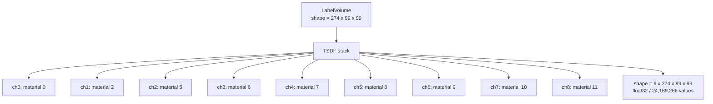

#### このグラフの読み方

この図が示すのは、「各材料の内部・外部を別々の距離場として持っている」ということです。  
そのため、材料 A と材料 B の境界を後から失わずに扱えます。  
multi-material 解析で本コードが有利なのは、この構造を最初から採用しているためです。

### 8.2 SDF チャンネルの内部比率グラフ

各 TSDF チャンネルについて、`TSDF < 0` のボクセル比率を求めると次の通りです。  
これは「その材料が空間のどれくらいを占めているか」を、SDF 側から見た値です。

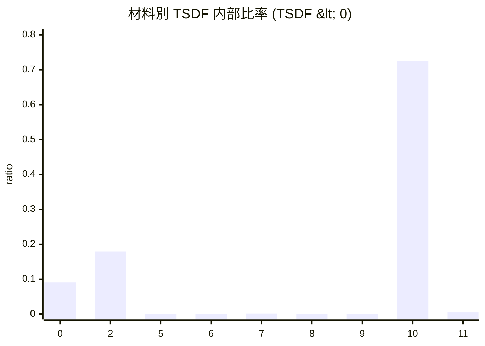

#### このグラフの読み方

この値は、先ほどの voxel 構成比とほぼ対応しています。  
つまり、SDF 化した後も材料の空間占有関係は保持されており、label -> TSDF の変換で材料構造が壊れていないと読めます。  
特に `Material 10` の内部比率が 0.7246 と大きく、主材料であることが SDF 側でも明確です。

### 8.3 SDF の数値品質

| 指標 | 値 | 読み取り |
|---|---:|---|
| `tsdf_min` | -1.0 | 負側は truncation まで使われている |
| `tsdf_max` | 1.0 | 正側も truncation まで使われている |
| `nan_count` | 0 | 計算破綻なし |
| `inf_count` | 0 | 計算破綻なし |
| `dtype` | `float32` | 実用的な保存形式 |

この結果から、少なくとも代表ケースの SDF 生成は数値的に安定していると言えます。

### 8.4 保存済み SDF 図版

以下の図版は、すでに `outputs/vti_preview_postproc_t08/figures/` に保存されています。

#### SDF チャンネルの z 中央断面

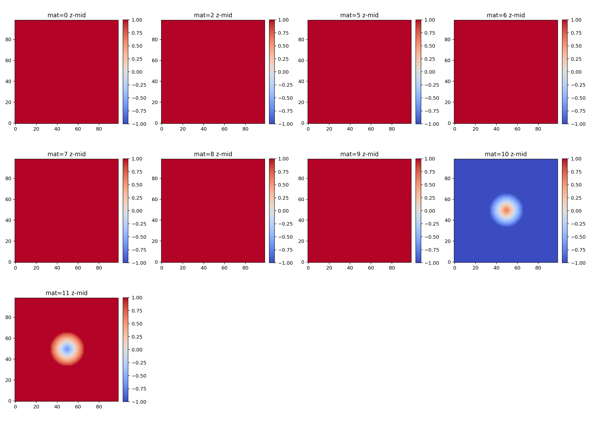

#### 最小絶対値 SDF の xyz 中央断面

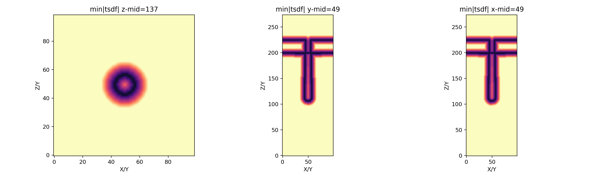

#### 図版の読み方

`sdf_channels_zmid_full.png` は、各材料チャンネルがどこで負領域を持つかを直接見せる図です。  
第三者が見るときは、「材料ごとに別の距離場を持っている」ことと、「少数材料も別チャンネルに残っている」ことに注目すると理解しやすいです。

`sdf_minabs_xyz_mid.png` は、各位置で最も近い界面までの距離のような見え方を与える補助図です。  
これは「どこに界面が集中しているか」「どこが厚く、どこが薄いか」の直感を与える図として有効です。

---

## 9. raw ラベルと変換後ラベルの一致度

preview 結果では、raw ラベルと converted ラベルの一致度を中間断面で確認しています。

### 9.1 slice 指標

| 断面 | IoU | Dice | Boundary Chamfer | Label Drift |
|---|---:|---:|---:|---:|
| x_mid | 1.0 | 1.0 | 0.0 | 0.0 |
| y_mid | 1.0 | 1.0 | 0.0 | 0.0 |
| z_mid | 1.0 | 1.0 | 0.0 | 0.0 |

### 9.2 この結果の意味

この結果は、少なくとも代表ケースでは、

- PointData -> CellData 変換
- label -> TSDF roundtrip
- 中央断面での境界位置

が完全一致していることを意味します。

すなわち、「SDF へ変換したことでラベル構造が崩れた」という兆候はありません。

### 9.3 保存済み断面図

#### raw / converted 断面比較

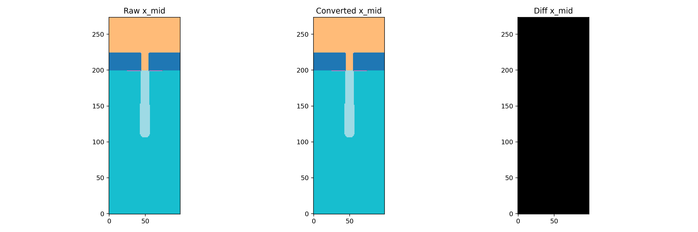

#### 境界オーバーレイ

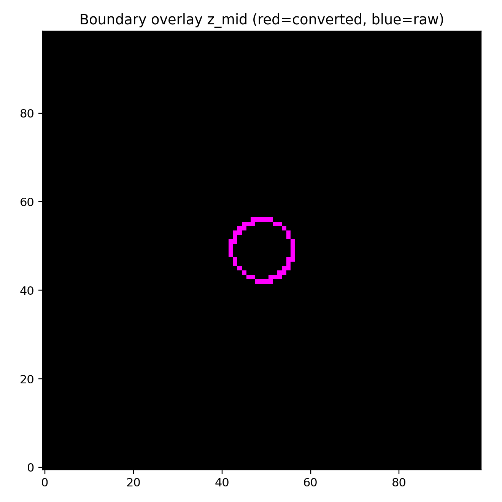

#### 図版の読み方

`raw_vs_conv` 図では、変換前後のラベルが同じ場所に現れているかを見ます。  
`boundary_overlay` 図では、境界線が色ズレなく重なっていれば、幾何変形がほぼないと判断できます。

---

## 10. Mesh 後処理で何が起きているか

SDF から mesh を作ったあと、preview では VTK smoothing と subdivision がかかっています。  
ここは「見た目を整える処理」であり、「定量評価にそのまま使ってよいか」は別問題です。

### 10.1 面数の変化

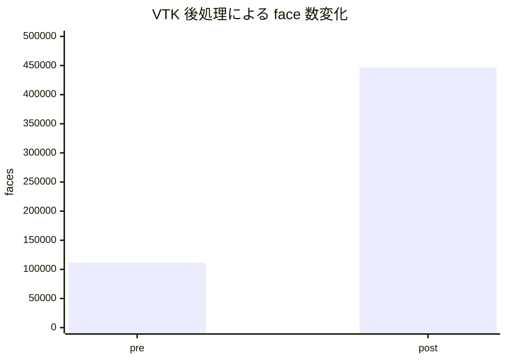

### 10.2 mesh 後処理 QA

| 指標 | 値 | 読み方 |
|---|---:|---|
| `pre_faces` | 111,612 | 後処理前の面数 |
| `post_faces` | 446,448 | subdivision 後の面数 |
| `bbox_shift_nm` | 0.5607 | 全体位置は大きくは動いていない |
| `area_rel_error` | 0.99994 | 面積は大きく変化している |
| status | `WARN` | 可視化向け処理としては許容、定量用は要注意 |

### 10.3 この結果の意味

この結果は、「見た目を滑らかにする mesh 後処理」は機能しているが、元の幾何量を大きく変える可能性があることを示します。  
したがって、本コードを実運用する際は次の分離が重要です。

1. 定量比較用の mesh
2. 可視化共有用の mesh

この 2 つを同一設定にしない方が安全です。

### 10.4 保存済み 3D 図版

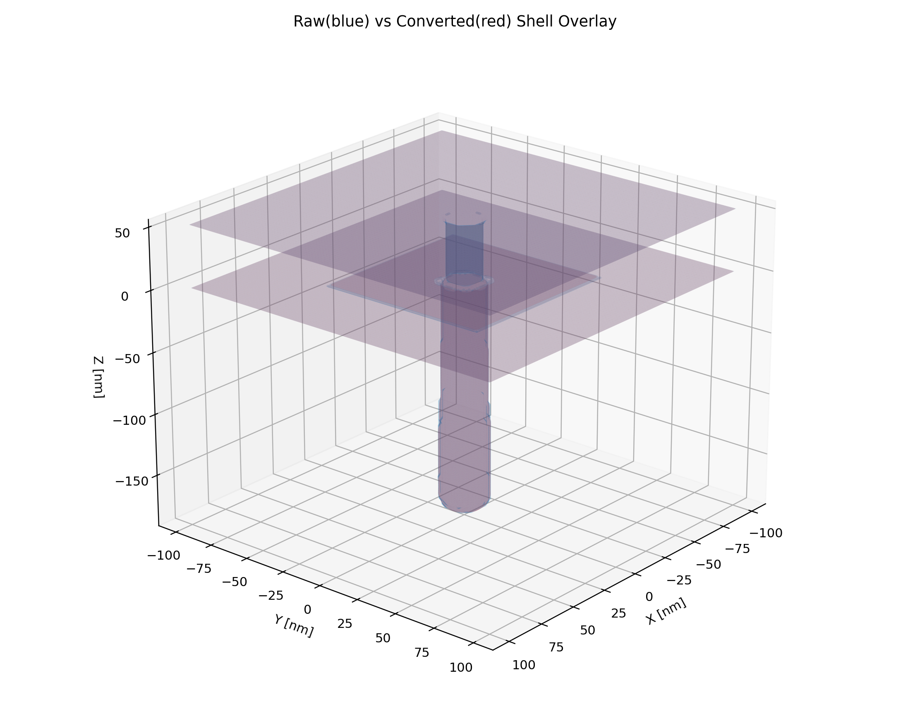

#### 図版の読み方

この図では、後処理前後のシェルがどの程度ずれているかを視覚的に確認できます。  
bbox shift は小さい一方で、面が細かく分割されて表面が滑らかになっているため、見た目の改善と幾何忠実度は別軸であることがわかります。

---

## 11. benchmark 結果

preview は 1 ケースの詳細確認ですが、benchmark は手法差の比較に向いています。  
ここでは `outputs/bench_vti_t08_x3/` に保存された結果を読みます。

### 11.1 全体平均

| 指標 | 値 |
|---|---:|
| SDF roundtrip accuracy mean | 1.0 |
| material_shell mesh IoU mean | 0.99181 |
| interface_mesh IoU mean | 0.99194 |
| material_shell chamfer mean | 0.58858 nm |
| interface_mesh chamfer mean | 0.60123 nm |
| render diff rate mean | 0.0 |
| policy_gap_real_vti | 0.01521 |

### 11.2 代表ケース `real_vti` の条件別比較

| Policy | Backend | Point-to-cell match | Mesh IoU | Chamfer [nm] |
|---|---|---:|---:|---:|
| nearest | naive_interface | 1.0000 | 1.0000 | 0.5528 |
| nearest | vtk | 1.0000 | 0.9936 | 0.6210 |
| majority | naive_interface | 0.9848 | 1.0000 | 0.5528 |
| majority | vtk | 0.9848 | 0.9832 | 0.6671 |

### 11.3 Mesh Boundary IoU グラフ

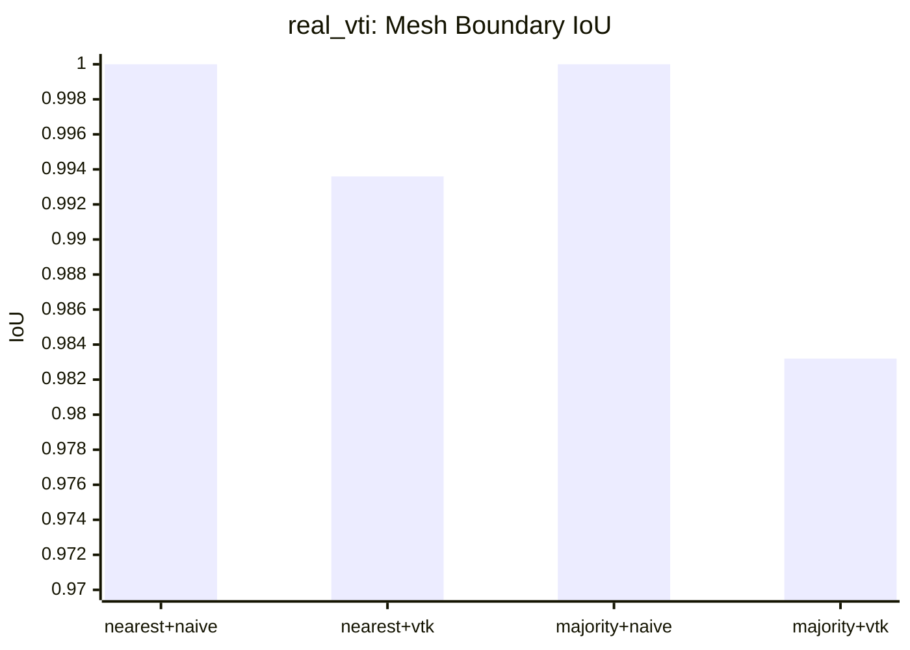

### 11.4 Mesh Boundary Chamfer グラフ

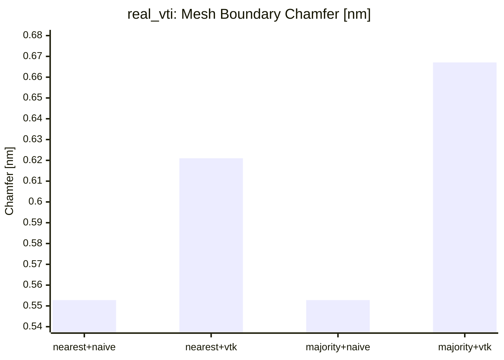

### 11.5 この結果の意味

この 2 つのグラフから読めることは明確です。

- `naive_interface` は元ラベル境界への忠実度が高い
- `vtk` はより滑らかな表面を作るが、境界 IoU は少し下がる
- `majority` は `nearest` より point-to-cell match が低い
- SDF roundtrip 自体は全条件で 1.0 なので、差が出る主因は mesh 化とその設定

つまり、「SDF までは安定」「mesh で backend の個性が出る」という構図です。

### 11.6 benchmark 図版

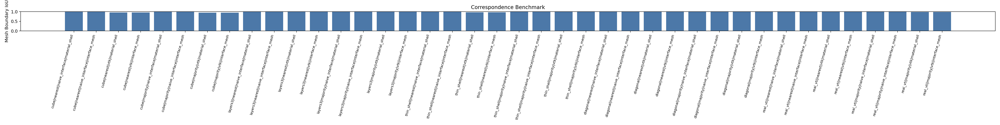

#### 図版の読み方

この図は、複数シナリオでの境界 IoU を一覧できる図です。  
個別数値を表で追うより、backend ごとの傾向差を直感的に把握しやすいという利点があります。

---

## 12. 本コードによる効果

実データと既計算結果から見て、本コードの効果は次のように整理できます。

| 効果 | 実結果との対応 |
|---|---|
| 入力の揺れに強い | PointData 入力でも slice IoU = 1.0 |
| 材料構造を保持できる | 少数材料を含む 9-channel TSDF stack を保持 |
| SDF 変換が安定 | TSDF 範囲は `[-1,1]`、NaN / Inf は 0、roundtrip accuracy = 1.0 |
| 界面情報を扱える | `pair_counts` で主要界面を明示できる |
| backend 比較が可能 | `naive_interface` と `vtk` の差を benchmark で定量化できる |
| 可視化と定量のズレを発見できる | preview が postprocess を `WARN` として記録する |
| 再現性が高い | manifest, hash, artifact 出力が整っている |

この表から、本コードは単なる変換処理ではなく、「形状評価のための共通実験基盤」として機能していることがわかります。

---

## 13. 将来性

### 13.1 技術的な伸びしろ

本コードの将来性は高いです。理由は、拡張点が比較的きれいに分離されているからです。

- SDF backend を追加しやすい
- mesh extractor を追加しやすい
- observer や metric を増やしやすい
- surrogate dataset と assimilation が同じ基盤を共有している
- report 系が表抽出と plot plugin に分かれている

### 13.2 実務上の改善ポイント

特に重要なのは次の 3 点です。

1. 定量評価用 mesh と可視化用 mesh を分ける  
   今回の preview では、滑らか化は有効でも面積誤差が大きく、役割分離が必要とわかります。

2. pipeline 末端の契約をさらにそろえる  
   既存テストでは pipeline 周辺に契約ずれが残っており、ここを整えると運用しやすさが上がります。

3. `Obs2D` を中心とした評価パターンをさらに標準化する  
   ここが本設計の最も強い部分なので、surrogate / assimilation / SEM 比較をさらに統一しやすくなります。

---

## 14. 総評

第三者向けに短くまとめると、本コードは次のような基盤です。

> 3D 半導体形状を、材料別 SDF・mesh・2D 観測へ変換し、最終的には同じ 2D 比較空間で評価できるようにした実験基盤

代表ケース `run_0000 / t08` では、

- label と SDF の対応は非常に良い
- 断面一致は IoU = 1.0
- 材料構成は 9-channel TSDF として保持されている
- SDF の数値品質は安定している
- 一方で mesh 後処理は可視化向きで、定量用途には慎重な扱いが必要

ということが、実データから確認できました。

したがって、本コードの最も優れた点は「比較の統一」と「再現性」です。  
今後は、可視化向け処理と定量向け処理をより明確に分けることで、研究用途から実運用向け基盤へさらに発展できる構成だと評価できます。
